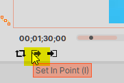
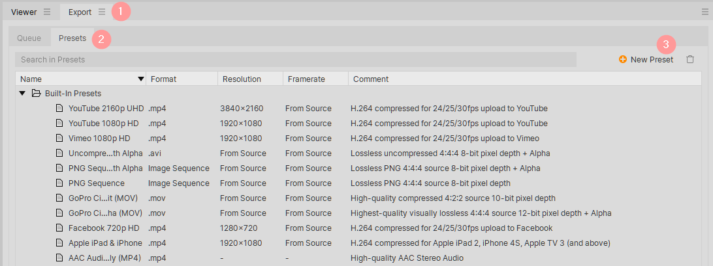
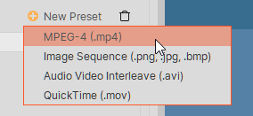
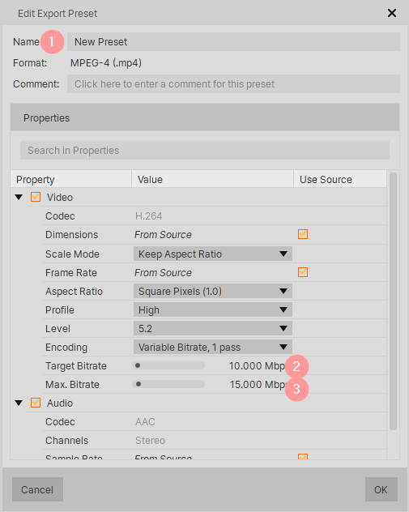
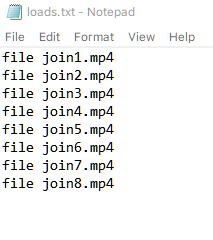
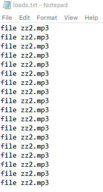

## Hitfilm and FFMPEG

#

### Export video dengan partisi video 5 menit

meg


1. Set In Point

menggunakan Set In Point, untuk menset durasi awal dari partisi video

sebelum di klik



setelah di klik


2. Set Out Point

dengan cara yang sama, menset durasi akhir dari partisi video


### Setup Preset mp4S

1. Buka Halaman Presets



2. Tekan tombol New Preset > pilih MPEG-4



3. Pastikan kolom-kolom berikut ini



### Membuat Output dari Hitfilm menjadi kecil

1. Menggunakan CRF 27

```powershell
ffmpeg -i .\o5.mp4 -vcodec libx264 -crf 27 -preset veryfast -c:a copy join5.mp4
```

dari filesize 324 MB turun menjadi -> 12.5 MB

2. Menggunakan CRF 20

```powershell
ffmpeg -i .\o5.mp4 -vcodec libx264 -crf 20 -preset veryfast -c:a copy join5.mp4
```

dari filesize 324 MB turun menjadi -> 25.5 MB

###### Perubahan tidak terlalu terlihat beda


original


crf20

crf27

### Menggabungkan beberapa File video

1. membuat file txt yang berisi nama-nama video yang akan digabung



2. menjalankan script pada Powershell sebagai berikut:

```powershell
ffmpeg -f concat -safe 0 -i .\loads.txt -c copy all.mp4    
```

3. hasil penggabungan video akan dapat dibuka pada file all.mp4

### Merubah audio .webm menjadi .mp4

dengan menggunakan script berikut :

```powershell
ffmpeg -i .\zz.webm zz.mp3  
```

### Membuat Audio loop selama 36 menit

1. hitung berapa panjang file audio zz.mp3

> panjang audio asli : 2 menit
> 
> berarti ada pengulangan sebanyak 36 / 2
> 
> loop yang dibutuhkan : 18 kali

2. buat 18 baris pada loads.txt



3. powershell script

```powershell
ffmpeg -f concat -safe 0 -i .\loads.txt -c copy zznew.mp3
```

### Menggabungkan video .mp4 dan audio .mp3

dengan menggunakan script berikut :

```powershell
ffmpeg -i .\all.mp4 -i zznew.mp3 -shortest -c copy nice.mp4
```

perlu diperhatikan, argumen `-shortest` akan mempengaruhi durasi dari hasil akhir video.

jika durasi Video lebih sedikit, maka durasi pada hasil akhir akan mengikuti durasi Video.

sebaliknya, jika durasi Audio lebih sedikit, maka durasi pada hasil akhir akan mengikuti durasi Audio